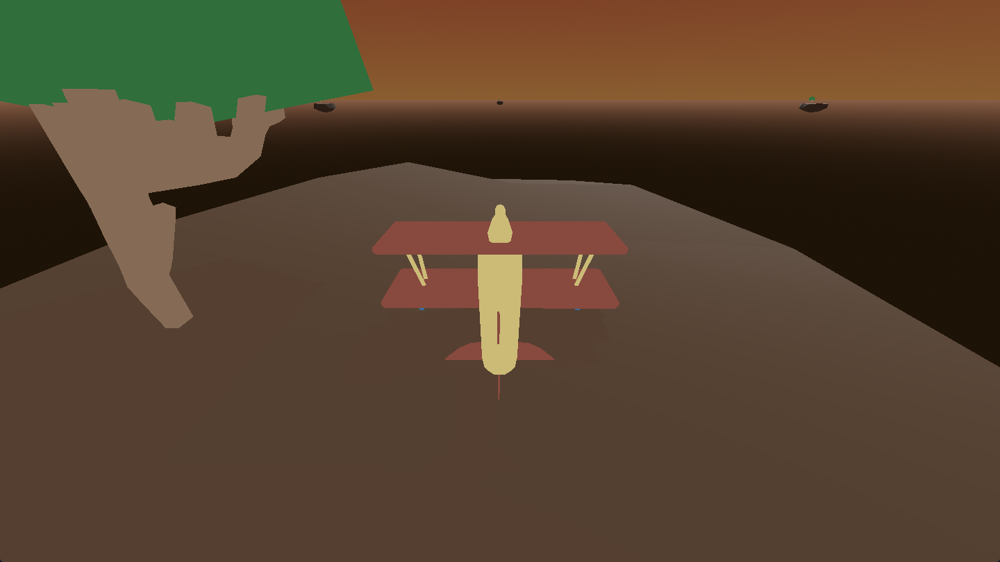

# Game Design Document

# Pitch, 3C, Moodboard

<aside>

**Pitch :** 

"Sur l’archipel de Gallia, une de ses îles, Yvelines-les-Flots, est en proie à une lente submersion depuis plusieurs années. Il ne reste plus qu’une poignée d’îlots éparpillés, reliés entre eux par une des tours radio du syndicat de l’archipel. Malgré tout, quelques irréductibles continuent d’y vivre et d’avoir besoin de livraisons.

Vous suivez Meli, récemment engagée dans le protocole COLLAPS-40, dédié à la livraison de colis et à l’entretien du réseau radio reliant les îles. Pour sa toute dernière mission, elle se rend à Yvelines-les-Flots, prête à livrer ses derniers colis et à rencontrer ses habitants avant de rendre définitivement son badge."

</aside>

## 3C

### Camera :

<aside>

on est toujours dans l’avion que l’on vois en Third perso , plus ou moins incliné du coté droit de l’avion, la camera suit toujours les déplacement de l’avion

</aside>

### Controller :

<aside>

prise de vitesse : on prend de la vitesse avec R2 et ralentis avec L2 ( shift pour prendre, ctrl pour ralentir au clavier ) 

</aside>

<aside>

Rotation : On rotatione l’avions avec le joystick gauche, le joystick gauche , pour faire décaller l’avion sur la gauche ou droite

</aside>

<aside>

Atterissage/décollage : on décolle et atteris avec le joystick gauche.

</aside>

---

il y a des séquence de dialogue mais on passe directement en dialogue quand on atteris et que on sort de l’avions ( en cliquant sur X a la manette ou E au clavier 

### Character :

On suit Meli, une jeune fille en rupture amoureuse qui a décidé de s’engager dans le système bénévolats de COLLAPS relians les différentes iles de l’archipel de Gallia, sa nouvelle mission est de livrer la derniere livraison de colis pour yvelines les flot avant que les habitants quittes les lieux.

## Moodboard

# Système de jeu, level design, et boucle de jeu

- Le système de jeu est simple : chaque jour on nous assigne une mission :
    - Titre de la mission
    - Indication pour trouver l’ile
    - ordre du jour description du personnage

# Diagramme de classe et script ( algorithme pour les dialogues )

# Flowchart, déroulé narrative, script et narramiete

tu controle meli une jeune fille qui vie sur la grande archipel de gallia. suite a une rupture amoureuse elle décide de s'engager dans le syndicat l'organisme mettant en place le fonctionnement des tour radio maintenant les iles composant l'archipel. une de tes mission t'amène a faire la dernière livraison pour une ile qui a été progressivement été submergé jusqu'à devenir une mini archipel au seins de la grande archipel de gallia. cet iles devenue petite archipel s'appelle yveline les flot

l'ile va bientot etre définitivement subermergé, mais tant qu'elle est la elle a besoin de colis et c'est la mission de meli. tu l'incarnes au bord d'un petit avions, elle reçois une mission choisit aléatoirement parmit un pull de mission prédéterminé, assigné chacune a une ile et un personnage, la position des différentes iles est choisit aléatoirement malgré que les iles sont toujours les meme.

il y a 5 ile ( pour l'instant ) :

l'ile de départ , l'ile du hangar , c'est ici que le bastion du syndicat de l'archipel yveline les flot se trouve, composé de ton avions, des bidons de toute sorte, de quoi entretenir l'avions, et la tour radio qui permet a l'avion de se déplacer, mais aussi donner la localisation de l'archipel, ainsi qu'une piste de départ

l'ile de la ferme du vieux jean : la ferme est encore intact , mais tout autour a été submergé, le vieux jean vie ici accompagné de quelque vache, avec son fils ils ont commencé a se préparer a partir , le vieux jean attend une lettre d'un ancien camarade a lui qui est partit plus tot.

l'ile de l'ancien tank : un ancien tank git quelque part entouré de verdure, et d'un petit etant , la bas se trouve la cabanes du petit jean, il est le plus réticent a partir, il idolatre vachement le syndicat, et s'amuse a se prendre pour eue

l'ile du bistro : la bas se trouve karim, leon , et hughette, trois vieux personnage, qui rigole beaucoup et aime se souvenir du temps passé quand ils ont lutté pour le syndicat, il boivent un dernier verre avant de plier bagage, il se souviennes comment yvelines les flot a été un point capitale de lutte par le passé, karim attendais une livraison d'un bouteille particulière

l'ile de docteur boogie love : étrange lieux ou se trouve un discaire fermé, avec des colis pleins l'entrée, docteur boogie love s'y trouve, il fredonne une melodie, il attendais quelque chose qu'il avais commandé bien bien avant mais pour une étrange raison a pris une éternité a venir. c'est un personnage exentrique fan de mauvaise musique, remplie de fausse anecdote.

[https://fr.wikipedia.org/wiki/Antonov_An-2](https://fr.wikipedia.org/wiki/Antonov_An-2)

[planning (1)](https://www.notion.so/2468bef3155180d09c2ce5174ae4138c?pvs=21)