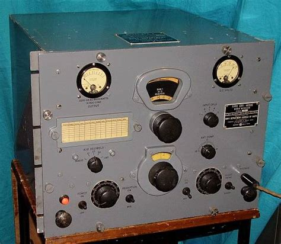
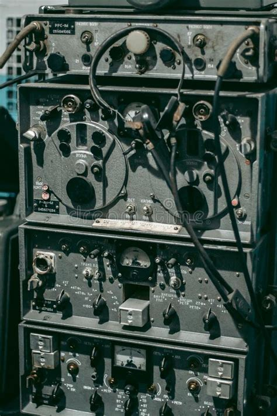
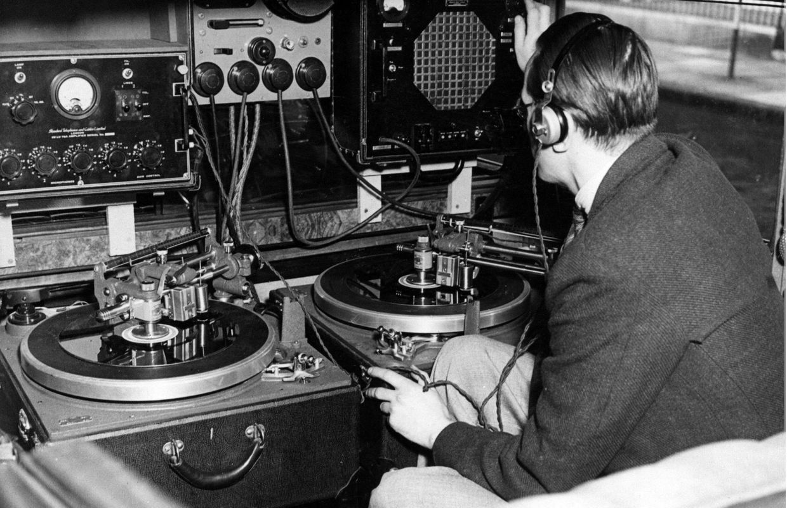
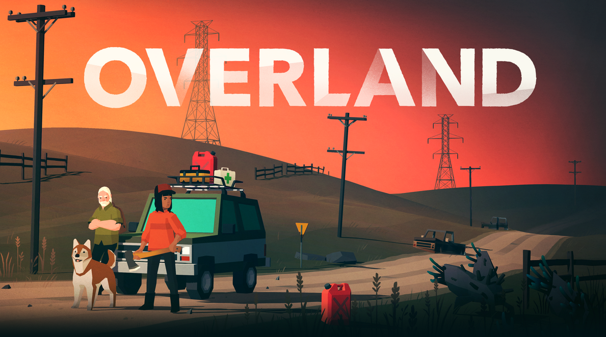
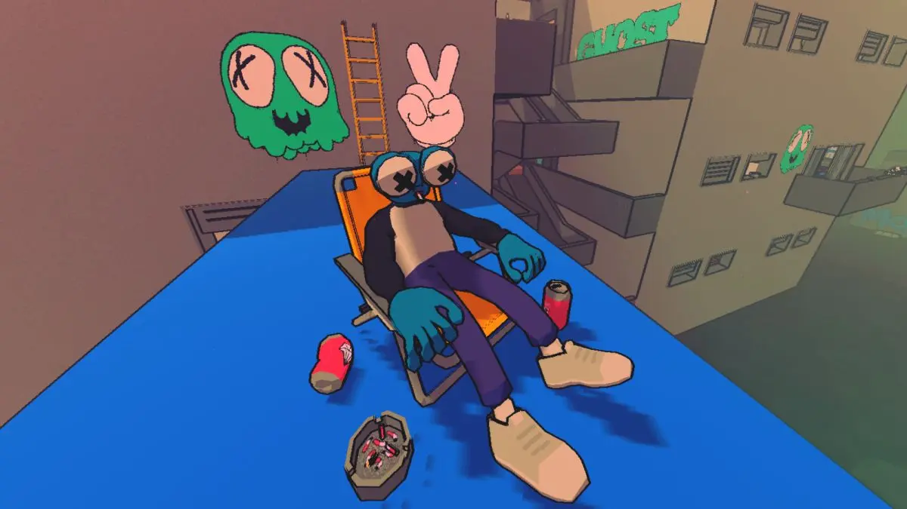
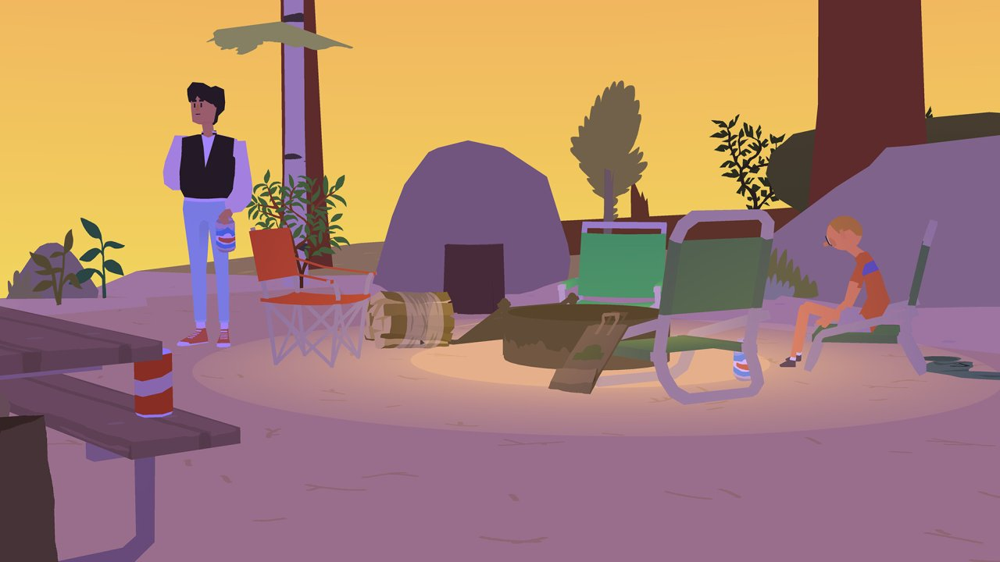
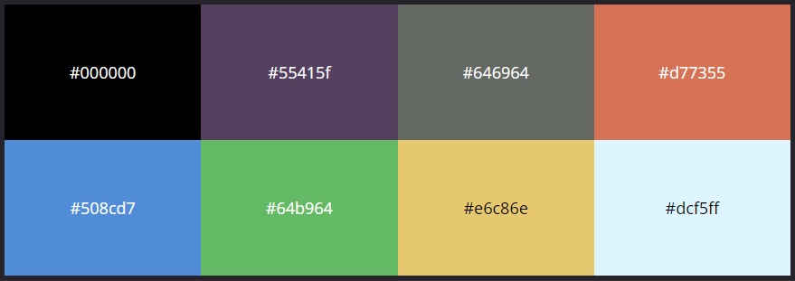

# Bible

### Sujets

.png)

Radio Allemande de la WW2

.png)

 )](1(3).png)

Radios Américaines de la WW2 ( s : [https://j28ro.blogspot.com/2012/12/materiels-radio-de-la-seconde-guerre.html](https://j28ro.blogspot.com/2012/12/materiels-radio-de-la-seconde-guerre.html) )

.png)

Des photos stocks sans précision

Illustration d’un article pour La Guerre des Ondes, image d’archive de la Radio de Londre

 )](048731097de322302aff7e52151c991d_L-696x450.png)

Photo du correspondant Britannique Wynford Vaughan Thomas à la BBC ( s : [https://www.us-militaria.com/blog/multimedia/32-enregistrements-radio-seconde-guerre/](https://www.us-militaria.com/blog/multimedia/32-enregistrements-radio-seconde-guerre/) )

### 3D/Style

A Short Hike

Overland

Sludge Life

Wide Ocean Big Jacket 

Wavetale

---

### *Palette*

propositon de palette

## tentative de sketch

### sketch test 1

